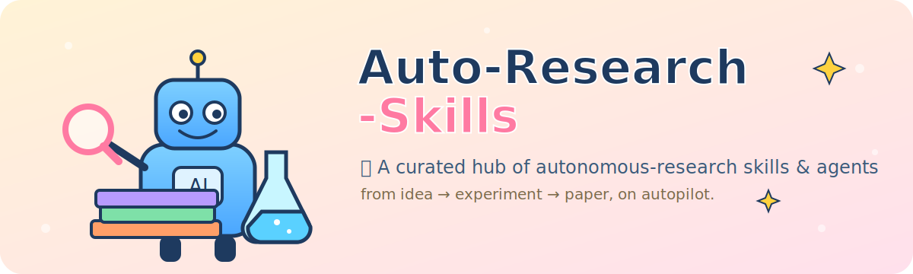

<div align="center">
  
</div>

<h1 align="center">Auto-Research-Skills</h1>

<p align="center">
  <b>自动化研究 <i>技能</i> 与智能体的精选合集</b> —— 从想法 → 实验 → 论文，全程自动驾驶。
</p>

<p align="center">
  <a href="#"></a>
  <a href="LICENSE"></a>
  
  <a href="CONTRIBUTING.md"></a>
</p>

<p align="center"><a href="README.md">English</a> · <b>简体中文</b></p>

---

### ⭐ 重点技能

> **[Imbad0202/academic-research-skills](https://github.com/Imbad0202/academic-research-skills)** &nbsp;·&nbsp; ~22.7k ⭐ &nbsp;·&nbsp; 🧩 已收录
> 面向 Claude Code 的学术研究技能集 —— 完整的 **research → write → review → revise → finalize** 流水线，覆盖文献综述与同行评审。收录于 [`skills/academic-research-skills`](skills/academic-research-skills)。

---

> **这是什么？** 一个社区精选的**自动化研究**中心 —— 收纳可复用技能（skills）、端到端系统（systems）、以及精选清单（lists），打包好让编码智能体（Claude Code、Codex、OpenClaw 及任意 LLM agent）直接调用。**41 个仓库**以 **git 子模块**（浅克隆）形式收录，分别放在 [`skills/`](skills/)、[`systems/`](systems/)、[`lists/`](lists/) 三个目录，一次克隆即可拿到整套工具箱。

```bash
# 一次性拉全（含所有子模块，浅克隆）
git clone --recurse-submodules https://github.com/brycewang-stanford/Auto-Research-Skills.git

# 已经克隆过？把子模块都拉进来
git submodule update --init --recursive

# 或使用辅助脚本
./setup.sh
```

> 📊 实时排名见 [**STARS.md**](STARS.md) —— 由 [GitHub Action](.github/workflows/update-stars.yml) 每周自动刷新。

## 目录

- [🧠 端到端自主研究系统](#-端到端自主研究系统)
- [🔎 深度研究与文献综合](#-深度研究与文献综合)
- [🧪 自动化实验与代码智能体](#-自动化实验与代码智能体)
- [🧩 研究技能与插件合集](#-研究技能与插件合集)
- [📚 精选清单与综述](#-精选清单与综述)
- [🗂️ 已收录仓库（子模块）](#️-已收录仓库子模块)
- [🤝 贡献](#-贡献)
- [📄 协议](#-协议)

> **图例：** ⭐ = 约略 star 数 · 🧩 = 已作为子模块收录
> **说明：** 下列每个项目都已作为子模块收录在 `skills/`、`systems/` 或 `lists/` 下 —— 详见 [已收录仓库](#️-已收录仓库子模块)。

---

## 🧠 端到端自主研究系统

> 自动化**完整**研究生命周期的项目：想法 → 实验 → 论文 → 评审。

| 项目 | ⭐ | 技术栈 | 说明 |
|---|---|---|---|
| [aiming-lab/AutoResearchClaw](https://github.com/aiming-lab/AutoResearchClaw) | ~12.8k | Agent | 全自主、自进化研究，从想法到论文。 |
| [SakanaAI/AI-Scientist](https://github.com/SakanaAI/AI-Scientist) | ~13.8k | Python | 提想法、跑实验、写论文并自动评审。 |
| [Sibyl-Research-Team/AutoResearch-SibylSystem](https://github.com/Sibyl-Research-Team/AutoResearch-SibylSystem) | ~247 | Claude Code | 自进化自主研究系统，原生构建于 Claude Code。 |

## 🔎 深度研究与文献综合

> 自动化信息收集、文献综述、带引用的报告生成。

| 项目 | ⭐ | 技术栈 | 说明 |
|---|---|---|---|
| [assafelovic/gpt-researcher](https://github.com/assafelovic/gpt-researcher) | ~27.3k | Python | 规划 → 抓取 → 带引用报告。经典之作。 |
| [stanford-oval/storm](https://github.com/stanford-oval/storm) | ~28.3k | Python | 维基百科式长篇报告合成（斯坦福）。 |
| [bytedance/deer-flow](https://github.com/bytedance/deer-flow) | ~70k | LangGraph | 深度研究，支持人机协同。 |
| [HKUDS/Auto-Deep-Research](https://github.com/HKUDS/Auto-Deep-Research) | ~1.5k | Agent | 低成本、全自动的个人研究助手。 |

## 🧪 自动化实验与代码智能体

> 编码、实验执行、迭代优化全程自动。

| 项目 | ⭐ | 技术栈 | 说明 |
|---|---|---|---|
| [Xiangyue-Zhang/auto-deep-researcher-24x7](https://github.com/Xiangyue-Zhang/auto-deep-researcher-24x7) | ~975 | Agent | 7×24 跑深度学习实验，Leader-Worker，常量内存。 |
| [TheBlewish/Automated-AI-Web-Researcher-Ollama](https://github.com/TheBlewish/Automated-AI-Web-Researcher-Ollama) | ~3.0k | Ollama | 基于本地 LLM 的自动网络研究员。 |

## 🧩 研究技能与插件合集

> 可直接接入编码智能体的可复用技能集与插件。

| 项目 | ⭐ | 技术栈 | 说明 |
|---|---|---|---|
| [Imbad0202/academic-research-skills](https://github.com/Imbad0202/academic-research-skills) 🧩 ⭐ | ~22.7k | Claude Code · Python | **重点。** 学术研究 → 写作 → 评审 → 修订 → 定稿流水线。 |
| [wanshuiyin/Auto-claude-code-research-in-sleep](https://github.com/wanshuiyin/Auto-claude-code-research-in-sleep) 🧩 | ~10.8k | Markdown skills | ARIS —— 跨模型互审循环、想法发现、实验自动化，无框架锁定。 |
| [mshumer/autonomous-researcher](https://github.com/mshumer/autonomous-researcher) 🧩 | ~804 | Agent | 轻量级自主研究智能体。 |
| [openags/auto-research](https://github.com/openags/auto-research) 🧩 | ~284 | Agent + UI | 跨领域通用「AI 科学家」。 |

## 📚 精选清单与综述

| 项目 | ⭐ | 说明 |
|---|---|---|
| [handsome-rich/Awesome-Auto-Research-Tools](https://github.com/handsome-rich/Awesome-Auto-Research-Tools) | ~778 | 启发本仓库的那份清单。 |
| [worldbench/awesome-ai-auto-research](https://github.com/worldbench/awesome-ai-auto-research) | ~187 | 一份 AI auto-research 综述。 |
| [MinhaoXiong/awesome-automated-research](https://github.com/MinhaoXiong/awesome-automated-research) | ~116 | 自主研究系统精选清单。 |

---

## 🗂️ 已收录仓库（子模块）

**41 个仓库**（每个都 100+ ⭐）以浅克隆子模块形式收录在三个目录中，各自按 star 排序。运行 `git submodule update --init --recursive`（或 `./setup.sh`）即可全部拉取。完整带 star 的榜单见 [STARS.md](STARS.md)。

- **`skills/`** —— 27 个可复用技能集与插件合集
- **`systems/`** —— 11 个端到端系统与自主智能体
- **`lists/`** —— 3 个精选清单与综述

> 想收录你的仓库？见 [CONTRIBUTING](CONTRIBUTING.md) —— 提一个 PR，在 `skills/`、`systems/` 或 `lists/` 下添加子模块即可。

## 🤝 贡献

欢迎 PR！把项目加到合适的分类，或作为子模块收录。详见 [CONTRIBUTING.md](CONTRIBUTING.md)。

## 📄 协议

[CC0 1.0 Universal](LICENSE) —— 公共领域。各子模块保留其各自的许可协议。
