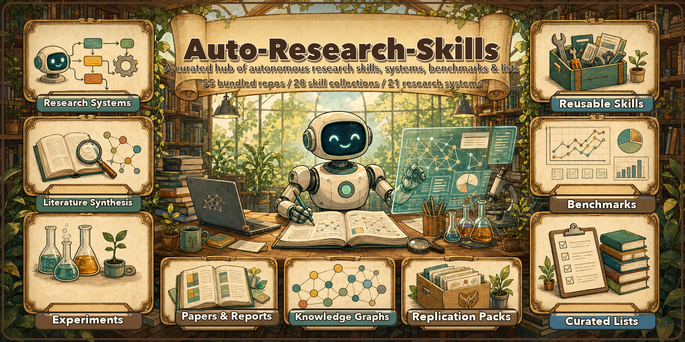

<div align="center">
  
</div>

<h1 align="center">Auto-Research-Skills</h1>

<p align="center">
  <b>A curated hub of autonomous-research <i>skills</i> & agents</b> — from idea → experiment → paper, on autopilot.
</p>

<p align="center">
  <a href="#research-skills--plugin-collections"></a>
</p>

<p align="center"><b>3,324 skills</b> bundled across <b>79 repos</b> — clone the whole research toolbox in one shot.</p>

<p align="center">
  <a href="#research-skills--plugin-collections"></a>
  <a href="#"></a>
  <a href="LICENSE"></a>
  
  <a href="CONTRIBUTING.md"></a>
  <a href="https://github.com/brycewang-stanford/StatsPAI"></a>
</p>

<p align="center"><b>English</b> · <a href="README.md">简体中文</a></p>

---

### Featured Skill

> **[Imbad0202/academic-research-skills](https://github.com/Imbad0202/academic-research-skills)** &nbsp;·&nbsp; ~22.7k stars &nbsp;·&nbsp; 🧩 bundled
> Academic Research Skills for Claude Code — a full **research → write → review → revise → finalize** pipeline, covering literature review and peer review. Vendored here at [`skills/academic-research-skills`](skills/academic-research-skills).

---

> **What is this?** A community-curated hub for **autonomous research** — reusable skills, full end-to-end systems, domain-science agents, evaluation benchmarks, and curated lists — packaged so that coding agents (Claude Code, Codex, OpenClaw, and any LLM agent) can plug them in directly. **3,324 skills** across **79 repos** are vendored here as **git submodules** (shallow), organized into [`skills/`](skills/), [`systems/`](systems/), [`benchmarks/`](benchmarks/), and [`lists/`](lists/), so you can clone the whole toolbox in one shot.

```bash
# recommended: clone first, then let setup.sh handle top-level + nested submodules
git clone https://github.com/brycewang-stanford/Auto-Research-Skills.git
cd Auto-Research-Skills
./setup.sh

# already cloned? refresh missing submodules
./setup.sh
```

## Table of Contents

- [End-to-End Autonomous Research Systems](#end-to-end-autonomous-research-systems)
- [Deep Research & Literature Synthesis](#deep-research--literature-synthesis)
- [Automated Experiment & Code Agents](#automated-experiment--code-agents)
- [Domain-Specific Science Agents](#domain-specific-science-agents)
- [Research Skills & Plugin Collections](#research-skills--plugin-collections)
- [Benchmarks & Evaluation](#benchmarks--evaluation)
- [Awesome Lists & Surveys](#awesome-lists--surveys)
- [Bundled Repos (submodules)](#bundled-repos-submodules)
  - [Skills & Plugin Collections](#skills--plugin-collections-skills)
  - [Systems & Agents](#systems--agents-systems)
  - [Benchmarks & Evaluation](#benchmarks--evaluation-benchmarks)
  - [Lists & Surveys](#lists--surveys-lists)
- [Contributing](#contributing)
- [License](#license)

> **Legend:** 🧩 = vendored here as a submodule.
> **Note:** the authoritative vendored inventory is [Bundled Repos](#bundled-repos-submodules). In the Research Skills table, unmarked rows are tracked candidates or useful adjacent projects.

---

## End-to-End Autonomous Research Systems

> Projects that automate the *full* research lifecycle: idea → experiment → paper → review.

| Project | Stars | Stack | Notes |
|---|---|---|---|
| [aiming-lab/AutoResearchClaw](https://github.com/aiming-lab/AutoResearchClaw) | ~12.8k | Agent | Fully autonomous & self-evolving research, from idea to paper. |
| [SakanaAI/AI-Scientist](https://github.com/SakanaAI/AI-Scientist) | ~13.8k | Python | Generate ideas, run experiments, write & auto-review papers. |
| [SakanaAI/AI-Scientist-v2](https://github.com/SakanaAI/AI-Scientist-v2) | ~6.4k | Python | v2 — agentic tree-search, workshop-grade papers, less template-bound. |
| [SamuelSchmidgall/AgentLaboratory](https://github.com/SamuelSchmidgall/AgentLaboratory) | ~5.6k | Python | LLM agents as research assistants across the full pipeline. |
| [HKUDS/AI-Researcher](https://github.com/HKUDS/AI-Researcher) | ~5.4k | Python | NeurIPS 2025 — autonomous scientific innovation, idea → paper. |
| [Sibyl-Research-Team/AutoResearch-SibylSystem](https://github.com/Sibyl-Research-Team/AutoResearch-SibylSystem) | ~247 | Claude Code | Self-evolving autonomous research system, Claude-Code native. |
| [ulab-uiuc/research-town](https://github.com/ulab-uiuc/research-town) | ~205 | Python | ICML 2025 — multi-agent simulator of a human research community. |

## Deep Research & Literature Synthesis

> Automated information gathering, literature review, and cited report generation.

| Project | Stars | Stack | Notes |
|---|---|---|---|
| [bytedance/deer-flow](https://github.com/bytedance/deer-flow) | ~70k | LangGraph | Deep research w/ human-in-the-loop. |
| [stanford-oval/storm](https://github.com/stanford-oval/storm) | ~28.3k | Python | Wikipedia-style long-form report synthesis. |
| [assafelovic/gpt-researcher](https://github.com/assafelovic/gpt-researcher) | ~27.3k | Python | Plan → scrape → cited report. The classic. |
| [dzhng/deep-research](https://github.com/dzhng/deep-research) | ~19.0k | TypeScript | The simplest iterative deep-research agent — refines its own direction. |
| [langchain-ai/open_deep_research](https://github.com/langchain-ai/open_deep_research) | ~11.5k | LangGraph | Open, configurable deep-research agent. |
| [Future-House/paper-qa](https://github.com/Future-House/paper-qa) | ~8.6k | Python | PaperQA2 — high-accuracy RAG over scientific PDFs with citations. |
| [LearningCircuit/local-deep-research](https://github.com/LearningCircuit/local-deep-research) | ~8.1k | Python | Local & private deep research; arXiv + PubMed, ~95% on SimpleQA. |
| [nickscamara/open-deep-research](https://github.com/nickscamara/open-deep-research) | ~6.2k | TypeScript | Open deep-research clone reasoning over Firecrawl-extracted web data. |
| [HKUDS/Auto-Deep-Research](https://github.com/HKUDS/Auto-Deep-Research) | ~1.5k | Agent | Low-cost, fully-automated personal research assistant. |
| [AutoSurveys/AutoSurvey](https://github.com/AutoSurveys/AutoSurvey) | ~468 | Python | Multi-stage pipeline for automated literature-survey generation. |

## Automated Experiment & Code Agents

> Coding, experiment execution, and iterative optimization on autopilot.

| Project | Stars | Stack | Notes |
|---|---|---|---|
| [going-doer/Paper2Code](https://github.com/going-doer/Paper2Code) | ~4.6k | Python | PaperCoder — turns an ML paper into a runnable code repository. |
| [WecoAI/aideml](https://github.com/WecoAI/aideml) | ~1.3k | Python | AIDE — ML-engineering agent; treats modeling as code-optimization search. |
| [Xiangyue-Zhang/auto-deep-researcher-24x7](https://github.com/Xiangyue-Zhang/auto-deep-researcher-24x7) | ~975 | Agent | Runs DL experiments 24/7, Leader-Worker, constant-size memory. |
| [Just-Curieous/Curie](https://github.com/Just-Curieous/Curie) | ~360 | Python | Rigorous, reproducible experimentation agent for ML research. |
| [TheBlewish/Automated-AI-Web-Researcher-Ollama](https://github.com/TheBlewish/Automated-AI-Web-Researcher-Ollama) | ~3.0k | Ollama | Local-LLM automated web researcher. |

## Domain-Specific Science Agents

> Agents that conduct real scientific work in a specific domain (bio, chemistry, multi-agent labs).

| Project | Stars | Domain | Notes |
|---|---|---|---|
| [snap-stanford/Biomni](https://github.com/snap-stanford/Biomni) | ~3.1k | Biomedicine | General-purpose biomedical AI agent across 150+ tools/databases. |
| [ur-whitelab/chemcrow-public](https://github.com/ur-whitelab/chemcrow-public) | ~915 | Chemistry | LLM chemistry agent for synthesis, drug discovery, materials. |
| [zou-group/virtual-lab](https://github.com/zou-group/virtual-lab) | ~685 | Multi-agent | A team of LLM "scientists" running interdisciplinary research (Stanford). |
| [lamm-mit/SciAgentsDiscovery](https://github.com/lamm-mit/SciAgentsDiscovery) | ~611 | Materials | MIT — multi-agent automated scientific discovery & hypothesis generation. |
| [Future-House/robin](https://github.com/Future-House/robin) | ~439 | Biomedicine | Multi-agent discovery; proposed a validated dry-AMD drug candidate. |
| [gomesgroup/coscientist](https://github.com/gomesgroup/coscientist) | ~203 | Chemistry | Autonomous chemical research with LLMs (Nature 2023). |

## Research Skills & Plugin Collections

> Reusable skill sets and plugins that drop into coding agents.

| Project | Stars | Stack | Notes |
|---|---|---|---|
| [Imbad0202/academic-research-skills](https://github.com/Imbad0202/academic-research-skills) 🧩 | ~22.7k | Claude Code · Python | **Featured.** Academic research → write → review → revise → finalize pipeline. |
| [Yuan1z0825/nature-skills](https://github.com/Yuan1z0825/nature-skills) 🧩 | ~13.4k | Claude Code · Python | Nature-grade academic phrasing + scientific figure plotting; Claude & Codex. |
| [wanshuiyin/Auto-claude-code-research-in-sleep](https://github.com/wanshuiyin/Auto-claude-code-research-in-sleep) 🧩 | ~10.8k | Markdown skills | ARIS — cross-model review loops, idea discovery, experiment automation. No framework lock-in. |
| [companion-inc/feynman](https://github.com/companion-inc/feynman) 🧩 | ~8.1k | CLI · Codex · Claude Code | Open-source AI research agent (CLI) on Pi + alphaXiv; 20 research skills — lit review, deep research, replication, peer review — installable into Codex/Claude. |
| [Galaxy-Dawn/claude-scholar](https://github.com/Galaxy-Dawn/claude-scholar) 🧩 | ~4.1k | Claude Code · MCP | Semi-automated research assistant; Zotero + Obsidian + MCP integration. |
| [blazickjp/arxiv-mcp-server](https://github.com/blazickjp/arxiv-mcp-server) 🧩 | ~2.8k | MCP | Search & retrieve arXiv papers directly inside any MCP-capable agent. |
| [K-Dense-AI/claude-scientific-writer](https://github.com/K-Dense-AI/claude-scientific-writer) 🧩 | ~1.9k | Claude Code · Python | General-purpose scientific writer. |
| [pedrohcgs/claude-code-my-workflow](https://github.com/pedrohcgs/claude-code-my-workflow) 🧩 | ~1.2k | Claude Code · LaTeX/R | Fork-ready academic template: multi-agent review, quality gates, replication. |
| [mshumer/autonomous-researcher](https://github.com/mshumer/autonomous-researcher) 🧩 | ~804 | Agent | Lightweight autonomous research agent. |
| [lishix520/academic-paper-skills](https://github.com/lishix520/academic-paper-skills) 🧩 | ~768 | Claude Code · Python | Systematic framework for planning & writing academic papers. |
| [andrehuang/research-companion](https://github.com/andrehuang/research-companion) 🧩 | ~665 | Claude Code | Strategic research-thinking agents: idea evaluation, triage, brainstorming. |
| [EvoScientist/EvoSkills](https://github.com/EvoScientist/EvoSkills) | ~380 | Agent Skills | Installable skill and knowledge packs for EvoScientist-style scientific workflows. |
| [openags/auto-research](https://github.com/openags/auto-research) 🧩 | ~284 | Agent + UI | Generalist "AI Scientist" across fields. |
| [Boom5426/Nature-Paper-Skills](https://github.com/Boom5426/Nature-Paper-Skills) 🧩 | ~252 | Claude Code · TeX | Draft, revise, audit & resubmit skills for Nature-style papers. |
| [Light0305/Light-skills](https://github.com/Light0305/Light-skills) 🧩 | ~151 | Claude Code · Codex | Full-pipeline research pack: 28 skills from literature review to submission, with verifiable knowledge bases and adversarial self-checks. |
| [poemswe/co-researcher](https://github.com/poemswe/co-researcher) 🧩 | ~101 | Claude Code · Codex · Gemini CLI | Multi-platform academic research suite with specialized agents and CLI workflows. |
| [LeonChaoX/qinyan-academic-skills](https://github.com/LeonChaoX/qinyan-academic-skills) | ~93 | Claude Code · Python | "沁言" academic library — 177 research agents. |
| [lingzhi227/agent-research-skills](https://github.com/lingzhi227/agent-research-skills) | ~85 | Claude Code · Python | Systematic academic deep-research skills. |
| [andrehuang/academic-writing-agents](https://github.com/andrehuang/academic-writing-agents) | ~80 | Claude Code | Multi-agent orchestrator with 10 specialist writing agents. |

## Benchmarks & Evaluation

> How good are these agents, really? Benchmarks for measuring autonomous-research and ML-engineering capability.

| Project | Stars | Measures | Notes |
|---|---|---|---|
| [snap-stanford/MLAgentBench](https://github.com/snap-stanford/MLAgentBench) | ~343 | ML engineering | Agents performing end-to-end ML experimentation tasks. |
| [Future-House/aviary](https://github.com/Future-House/aviary) | ~266 | Scientific agent tasks | A language-agent gym of challenging scientific tasks (FutureHouse). |
| [allenai/discoverybench](https://github.com/allenai/discoverybench) | ~145 | Data-driven discovery | Can LLMs derive hypotheses from real datasets? (AI2) |
| [OSU-NLP-Group/ScienceAgentBench](https://github.com/OSU-NLP-Group/ScienceAgentBench) | ~138 | Data-driven science | Rigorous benchmark of agents on real scientific tasks. |

## Awesome Lists & Surveys

| Project | Stars | Notes |
|---|---|---|
| [ai-boost/awesome-ai-for-science](https://github.com/ai-boost/awesome-ai-for-science) | ~1.6k | Curated AI-for-Science tools, datasets & frameworks across domains. |
| [VILA-Lab/Dive-into-Claude-Code](https://github.com/VILA-Lab/Dive-into-Claude-Code) | ~1.4k | Systematic analysis of Claude Code for designing AI-agent systems. |
| [handsome-rich/Awesome-Auto-Research-Tools](https://github.com/handsome-rich/Awesome-Auto-Research-Tools) | ~778 | The list that inspired this repo. |
| [DavidZWZ/Awesome-Deep-Research](https://github.com/DavidZWZ/Awesome-Deep-Research) | ~759 | ACL 2026 — agentic deep-research resources. |
| [scienceaix/deepresearch](https://github.com/scienceaix/deepresearch) | ~430 | Companion list to the Deep Research survey paper. |
| [worldbench/awesome-ai-auto-research](https://github.com/worldbench/awesome-ai-auto-research) | ~187 | A survey on AI auto-research. |
| [MinhaoXiong/awesome-automated-research](https://github.com/MinhaoXiong/awesome-automated-research) | ~116 | Curated list of autonomous research systems. |

---

## Bundled Repos (submodules)

**3,324 skills** across **79 repos** (every one with 100+ stars) are vendored as shallow git submodules across four folders, sorted by stars within each. Run `./setup.sh` to fetch them all; use `ARS_SKIP_NESTED_SUBMODULES=1 ./setup.sh` when you only need the top-level bundles.

> Live ranking: see [**STARS.md**](STARS.md) — auto-refreshed weekly by [a GitHub Action](.github/workflows/update-stars.yml).
>
> Curation backlog: see [**CURATION.md**](CURATION.md) for candidate skills found via registry/GitHub research, review criteria, and the current safety checklist.
>
> Maintainers: run `make check` before PRs (or the equivalent commands in [`CONTRIBUTING.md`](CONTRIBUTING.md)). `setup.sh` initializes top-level submodules first and then best-effort nested submodules declared by upstream repos, so one broken nested mapping does not block the whole checkout.
>
> **Picking an academic-research skill?** Several bundled packages overlap. Start with [`skills/academic-research-skills`](skills/academic-research-skills) (the featured, most-starred pipeline). Pick [`skills/academic-research-skills-codex`](skills/academic-research-skills-codex) or [`skills/codex-academic-skills`](skills/codex-academic-skills) if you're on **Codex** rather than Claude Code; [`skills/franklee-academic-research-skills`](skills/franklee-academic-research-skills) if you work in **econ/finance**; [`skills/claude-code-my-workflow`](skills/claude-code-my-workflow) for a **LaTeX/Beamer + R, fork-ready** academic setup; [`skills/empirical-research-skills`](skills/empirical-research-skills) for **empirical social-science** workflows.

### Skills & Plugin Collections (`skills/`)

38 reusable skill sets and plugins that drop into coding agents.

| Path | Source | Stars | What it gives you |
|---|---|---|---|
| `skills/last30days` | [mvanhorn/last30days-skill](https://github.com/mvanhorn/last30days-skill) | ~26.7k | Research any topic across Reddit, X, YouTube, HN, Polymarket. |
| `skills/scientific-agent-skills` | [K-Dense-AI/scientific-agent-skills](https://github.com/K-Dense-AI/scientific-agent-skills) | ~26.2k | Ready-to-use agent skills for research, science, engineering, analysis, finance. |
| `skills/academic-research-skills` | [Imbad0202/academic-research-skills](https://github.com/Imbad0202/academic-research-skills) | ~22.7k | **Featured.** research → write → review → revise → finalize. |
| `skills/nature-skills` | [Yuan1z0825/nature-skills](https://github.com/Yuan1z0825/nature-skills) | ~13.4k | Nature-grade academic phrasing + scientific figure plotting (Claude & Codex). |
| `skills/aris` | [wanshuiyin/Auto-claude-code-research-in-sleep](https://github.com/wanshuiyin/Auto-claude-code-research-in-sleep) | ~10.8k | Markdown-only autonomous-ML-research skills. |
| `skills/ai-research-skills` | [Orchestra-Research/AI-Research-SKILLs](https://github.com/Orchestra-Research/AI-Research-SKILLs) | ~9.0k | Open library of AI research & engineering skills for any model. |
| `skills/feynman` | [companion-inc/feynman](https://github.com/companion-inc/feynman) | ~8.1k | Open-source AI research agent (CLI) on Pi + alphaXiv; 20 research skills installable into Codex/Claude. |
| `skills/claude-scholar` | [Galaxy-Dawn/claude-scholar](https://github.com/Galaxy-Dawn/claude-scholar) | ~4.1k | Semi-automated research assistant; Zotero + Obsidian + MCP. |
| `skills/paper-writing-skills` | [Master-cai/Research-Paper-Writing-Skills](https://github.com/Master-cai/Research-Paper-Writing-Skills) | ~3.0k | ML/CV/NLP paper-writing skill package. |
| `skills/arxiv-mcp-server` | [blazickjp/arxiv-mcp-server](https://github.com/blazickjp/arxiv-mcp-server) | ~2.8k | MCP server to search & fetch arXiv papers from any agent. |
| `skills/academic-research-skills-codex` | [Imbad0202/academic-research-skills-codex](https://github.com/Imbad0202/academic-research-skills-codex) | ~1.9k | Codex-native academic research suite, human-in-the-loop. |
| `skills/claude-scientific-writer` | [K-Dense-AI/claude-scientific-writer](https://github.com/K-Dense-AI/claude-scientific-writer) | ~1.9k | General-purpose scientific writer (sibling of `scientific-agent-skills`). |
| `skills/academicforge` | [HughYau/AcademicForge](https://github.com/HughYau/AcademicForge) | ~1.3k | Curated skill collection for academic writing & research. |
| `skills/empirical-research-skills` | [brycewang-stanford/Auto-Empirical-Research-Skills](https://github.com/brycewang-stanford/Auto-Empirical-Research-Skills) | ~1.3k | 23k+ agent skills for empirical research across social sciences. |
| `skills/claude-code-my-workflow` | [pedrohcgs/claude-code-my-workflow](https://github.com/pedrohcgs/claude-code-my-workflow) | ~1.2k | Fork-ready academic Claude Code template (LaTeX/Beamer + R); multi-agent QA & replication. |
| `skills/x-research-skill` | [rohunvora/x-research-skill](https://github.com/rohunvora/x-research-skill) | ~1.1k | X/Twitter research: agentic search, thread following. |
| `skills/supervisor-skills` | [HKUSTDial/Supervisor-Skills](https://github.com/HKUSTDial/Supervisor-Skills) | ~1.1k | "AI 科研副导师" — from idea to paper submission. |
| `skills/deep-research-skills` | [Weizhena/Deep-Research-skills](https://github.com/Weizhena/Deep-Research-skills) | ~880 | Structured deep-research skill with human-in-the-loop (Claude Code / Codex). |
| `skills/medical-research-skills` | [aipoch/medical-research-skills](https://github.com/aipoch/medical-research-skills) | ~858 | Medical research: protocol design, data analysis, evidence. |
| `skills/scienceclaw` | [beita6969/ScienceClaw](https://github.com/beita6969/ScienceClaw) | ~823 | Self-evolving AI research colleague, 285 skills. |
| `skills/academic-paper-skills` | [lishix520/academic-paper-skills](https://github.com/lishix520/academic-paper-skills) | ~768 | Systematic framework for planning & writing academic papers. |
| `skills/claude-deep-research-skill` | [199-biotechnologies/claude-deep-research-skill](https://github.com/199-biotechnologies/claude-deep-research-skill) | ~726 | Enterprise deep-research, 8-phase pipeline, source credibility. |
| `skills/research-companion` | [andrehuang/research-companion](https://github.com/andrehuang/research-companion) | ~665 | Strategic research-thinking agents: idea evaluation, triage, brainstorming. |
| `skills/research-skills` | [luwill/research-skills](https://github.com/luwill/research-skills) | ~639 | Common research processes encapsulated as agent skills. |
| `skills/research-units-pipeline` | [WILLOSCAR/research-units-pipeline-skills](https://github.com/WILLOSCAR/research-units-pipeline-skills) | ~441 | Research pipelines as semantic execution units. |
| `skills/oneresearchclaw` | [gaotiexinqu/OneResearchClaw](https://github.com/gaotiexinqu/OneResearchClaw) | ~434 | Any materials → fully autonomous, skill-driven research. |
| `skills/openclaw-search-skills` | [blessonism/openclaw-search-skills](https://github.com/blessonism/openclaw-search-skills) | ~434 | OpenClaw deep-search: multi-source search & extraction. |
| `skills/awesome-scientific-skills` | [InternScience/Awesome-Scientific-Skills](https://github.com/InternScience/Awesome-Scientific-Skills) | ~400 | Curated Agent Skills for scientific research. |
| `skills/claudeblattman` | [chrisblattman/claudeblattman](https://github.com/chrisblattman/claudeblattman) | ~373 | Claude Code for academics — skills, agents, setup guides. |
| `skills/ai-research-feedback` | [claesbackman/AI-research-feedback](https://github.com/claesbackman/AI-research-feedback) | ~354 | Claude Code skills for academic research review. |
| `skills/nature-paper-skills` | [Boom5426/Nature-Paper-Skills](https://github.com/Boom5426/Nature-Paper-Skills) | ~252 | Draft, revise, audit & resubmit skills for Nature-style papers. |
| `skills/phd-skills` | [fcakyon/phd-skills](https://github.com/fcakyon/phd-skills) | ~246 | Paper reproduction, experiment design, paper review. |
| `skills/academic-skills` | [chtc66/academic-skills](https://github.com/chtc66/academic-skills) | ~227 | Paper reading, survey writing, experiment summary, rebuttal. |
| `skills/research-plugins` | [wentorai/research-plugins](https://github.com/wentorai/research-plugins) | ~223 | 350+ academic research skills, MCP configs & plugins. |
| `skills/codex-academic-skills` | [zLanqing/codex-claude-academic-skills](https://github.com/zLanqing/codex-claude-academic-skills) | ~172 | Three academic skills: reading, writing, scientific computing. |
| `skills/light-skills` | [Light0305/Light-skills](https://github.com/Light0305/Light-skills) | ~151 | 28 skills covering literature review → writing → review → submission, plus 9 verifiable knowledge bases. |
| `skills/franklee-academic-research-skills` | [franklee16/academic-research-skills](https://github.com/franklee16/academic-research-skills) | ~149 | Claude Code skills for econ/finance academic research. |
| `skills/co-researcher` | [poemswe/co-researcher](https://github.com/poemswe/co-researcher) | ~101 | Multi-platform research suite: literature review, methodology, synthesis, peer review, ethics, grants. |

### Systems & Agents (`systems/`)

30 end-to-end systems and autonomous agents — from idea to paper, deep-research report generation, domain-science labs, and 24/7 experiment runners.

| Path | Source | Stars | What it does |
|---|---|---|---|
| `systems/deer-flow` | [bytedance/deer-flow](https://github.com/bytedance/deer-flow) | ~70k | LangGraph deep-research SuperAgent w/ human-in-the-loop. |
| `systems/storm` | [stanford-oval/storm](https://github.com/stanford-oval/storm) | ~28.3k | Wikipedia-style long-form report synthesis (Stanford). |
| `systems/gpt-researcher` | [assafelovic/gpt-researcher](https://github.com/assafelovic/gpt-researcher) | ~27.3k | Plan → scrape → cited report. The classic. |
| `systems/deep-research` | [dzhng/deep-research](https://github.com/dzhng/deep-research) | ~19.0k | The simplest iterative deep-research agent; refines its own direction (TS). |
| `systems/ai-scientist` | [SakanaAI/AI-Scientist](https://github.com/SakanaAI/AI-Scientist) | ~13.8k | Generate ideas, run experiments, write & auto-review papers. |
| `systems/autoresearchclaw` | [aiming-lab/AutoResearchClaw](https://github.com/aiming-lab/AutoResearchClaw) | ~12.8k | Fully autonomous & self-evolving research, idea → paper. |
| `systems/open-deep-research` | [langchain-ai/open_deep_research](https://github.com/langchain-ai/open_deep_research) | ~11.5k | Open, configurable LangGraph deep-research agent. |
| `systems/paper-qa` | [Future-House/paper-qa](https://github.com/Future-House/paper-qa) | ~8.6k | PaperQA2 — high-accuracy RAG over scientific PDFs with citations. |
| `systems/local-deep-research` | [LearningCircuit/local-deep-research](https://github.com/LearningCircuit/local-deep-research) | ~8.1k | Local & private deep research; arXiv + PubMed, ~95% on SimpleQA. |
| `systems/ai-scientist-v2` | [SakanaAI/AI-Scientist-v2](https://github.com/SakanaAI/AI-Scientist-v2) | ~6.4k | v2 — agentic tree-search, workshop-grade papers. |
| `systems/open-deep-research-firecrawl` | [nickscamara/open-deep-research](https://github.com/nickscamara/open-deep-research) | ~6.2k | Open deep-research clone over Firecrawl-extracted web data. |
| `systems/agent-laboratory` | [SamuelSchmidgall/AgentLaboratory](https://github.com/SamuelSchmidgall/AgentLaboratory) | ~5.6k | LLM agents as research assistants across the full pipeline. |
| `systems/ai-researcher` | [HKUDS/AI-Researcher](https://github.com/HKUDS/AI-Researcher) | ~5.4k | NeurIPS 2025 — autonomous scientific innovation, idea → paper. |
| `systems/paper2code` | [going-doer/Paper2Code](https://github.com/going-doer/Paper2Code) | ~4.6k | PaperCoder — turns an ML paper into a runnable code repository. |
| `systems/biomni` | [snap-stanford/Biomni](https://github.com/snap-stanford/Biomni) | ~3.1k | General-purpose biomedical AI agent (150+ tools/databases). |
| `systems/web-researcher-ollama` | [TheBlewish/Automated-AI-Web-Researcher-Ollama](https://github.com/TheBlewish/Automated-AI-Web-Researcher-Ollama) | ~3.0k | Local-LLM automated web researcher (Ollama). |
| `systems/auto-deep-research` | [HKUDS/Auto-Deep-Research](https://github.com/HKUDS/Auto-Deep-Research) | ~1.5k | Low-cost, fully-automated personal research assistant. |
| `systems/aideml` | [WecoAI/aideml](https://github.com/WecoAI/aideml) | ~1.3k | AIDE — ML-engineering agent; modeling as code-optimization search. |
| `systems/auto-deep-researcher-24x7` | [Xiangyue-Zhang/auto-deep-researcher-24x7](https://github.com/Xiangyue-Zhang/auto-deep-researcher-24x7) | ~975 | Runs DL experiments 24/7, Leader-Worker architecture. |
| `systems/chemcrow` | [ur-whitelab/chemcrow-public](https://github.com/ur-whitelab/chemcrow-public) | ~915 | LLM chemistry agent for synthesis, drug discovery, materials. |
| `systems/autonomous-researcher` | [mshumer/autonomous-researcher](https://github.com/mshumer/autonomous-researcher) | ~804 | Lightweight autonomous research agent. |
| `systems/virtual-lab` | [zou-group/virtual-lab](https://github.com/zou-group/virtual-lab) | ~685 | A team of LLM "scientists" running interdisciplinary research (Stanford). |
| `systems/sciagents` | [lamm-mit/SciAgentsDiscovery](https://github.com/lamm-mit/SciAgentsDiscovery) | ~611 | MIT — multi-agent automated scientific discovery (materials). |
| `systems/autosurvey` | [AutoSurveys/AutoSurvey](https://github.com/AutoSurveys/AutoSurvey) | ~468 | Multi-stage pipeline for automated literature-survey generation. |
| `systems/robin` | [Future-House/robin](https://github.com/Future-House/robin) | ~439 | FutureHouse multi-agent discovery; validated a dry-AMD drug candidate. |
| `systems/curie` | [Just-Curieous/Curie](https://github.com/Just-Curieous/Curie) | ~360 | Rigorous, reproducible experimentation agent for ML research. |
| `systems/auto-research` | [openags/auto-research](https://github.com/openags/auto-research) | ~284 | Generalist "AI Scientist" across fields, with UI. |
| `systems/sibyl-system` | [Sibyl-Research-Team/AutoResearch-SibylSystem](https://github.com/Sibyl-Research-Team/AutoResearch-SibylSystem) | ~247 | Self-evolving autonomous research system, Claude-Code native. |
| `systems/research-town` | [ulab-uiuc/research-town](https://github.com/ulab-uiuc/research-town) | ~205 | ICML 2025 — simulator of a human research community. |
| `systems/coscientist` | [gomesgroup/coscientist](https://github.com/gomesgroup/coscientist) | ~203 | Autonomous chemical research with LLMs (Nature 2023). |

### Benchmarks & Evaluation (`benchmarks/`)

4 benchmarks for measuring how well autonomous agents actually do research and ML engineering.

| Path | Source | Stars | What it measures |
|---|---|---|---|
| `benchmarks/mlagentbench` | [snap-stanford/MLAgentBench](https://github.com/snap-stanford/MLAgentBench) | ~343 | Agents performing end-to-end ML experimentation tasks. |
| `benchmarks/aviary` | [Future-House/aviary](https://github.com/Future-House/aviary) | ~266 | A language-agent gym of challenging scientific tasks (FutureHouse). |
| `benchmarks/discoverybench` | [allenai/discoverybench](https://github.com/allenai/discoverybench) | ~145 | Whether LLMs can derive hypotheses from real datasets (AI2). |
| `benchmarks/scienceagentbench` | [OSU-NLP-Group/ScienceAgentBench](https://github.com/OSU-NLP-Group/ScienceAgentBench) | ~138 | Rigorous benchmark of agents on real data-driven science tasks. |

### Lists & Surveys (`lists/`)

7 curated collections / survey repos on the auto-research landscape.

| Path | Source | Stars | What it is |
|---|---|---|---|
| `lists/awesome-ai-for-science` | [ai-boost/awesome-ai-for-science](https://github.com/ai-boost/awesome-ai-for-science) | ~1.6k | Curated AI-for-Science tools, datasets & frameworks across domains. |
| `lists/dive-into-claude-code` | [VILA-Lab/Dive-into-Claude-Code](https://github.com/VILA-Lab/Dive-into-Claude-Code) | ~1.4k | Systematic analysis of Claude Code for designing AI-agent systems. |
| `lists/awesome-auto-research-tools` | [handsome-rich/Awesome-Auto-Research-Tools](https://github.com/handsome-rich/Awesome-Auto-Research-Tools) | ~778 | The list that inspired this repo. |
| `lists/awesome-deep-research` | [DavidZWZ/Awesome-Deep-Research](https://github.com/DavidZWZ/Awesome-Deep-Research) | ~759 | ACL 2026 — agentic deep-research resources. |
| `lists/awesome-deep-research-survey` | [scienceaix/deepresearch](https://github.com/scienceaix/deepresearch) | ~430 | Companion list to the Deep Research survey paper. |
| `lists/awesome-ai-auto-research` | [worldbench/awesome-ai-auto-research](https://github.com/worldbench/awesome-ai-auto-research) | ~187 | A survey on AI auto-research. |
| `lists/awesome-automated-research` | [MinhaoXiong/awesome-automated-research](https://github.com/MinhaoXiong/awesome-automated-research) | ~116 | Curated list of autonomous research systems. |

> Want your repo bundled? See [CONTRIBUTING](CONTRIBUTING.md) — open a PR adding a submodule under `skills/`, `systems/`, `benchmarks/`, or `lists/`.

## Contributing

PRs welcome! Add a tool to the right category, or vendor a skill as a submodule. See [CONTRIBUTING.md](CONTRIBUTING.md).

## License

[CC0 1.0 Universal](LICENSE) — public domain. The submodules retain their own licenses.
